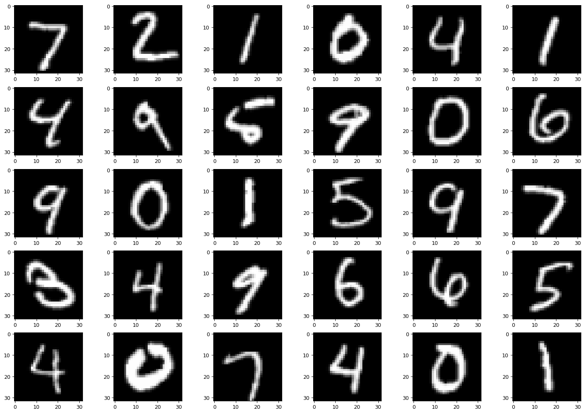
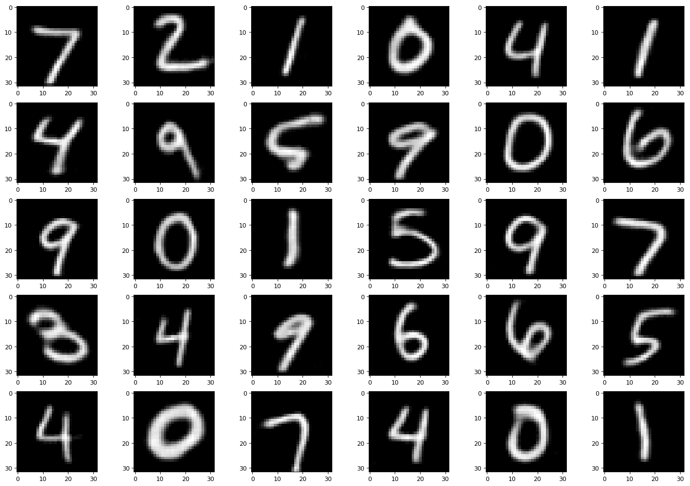
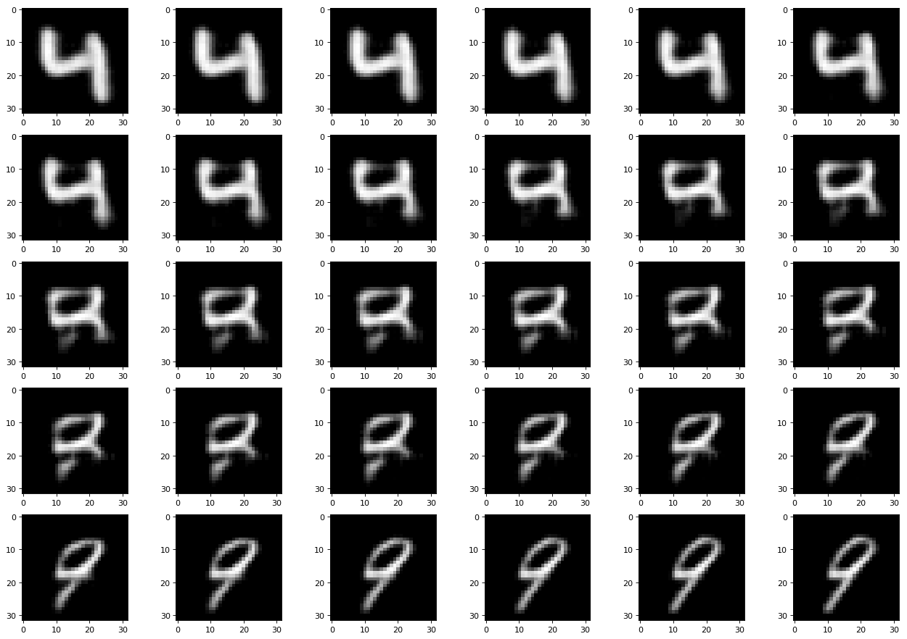
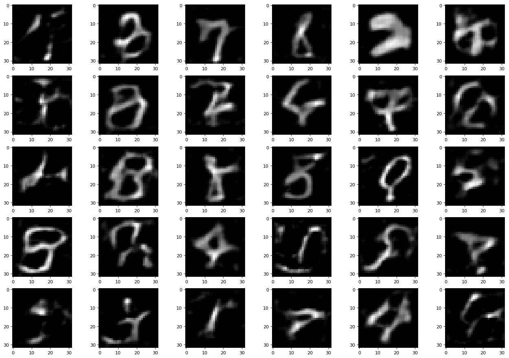
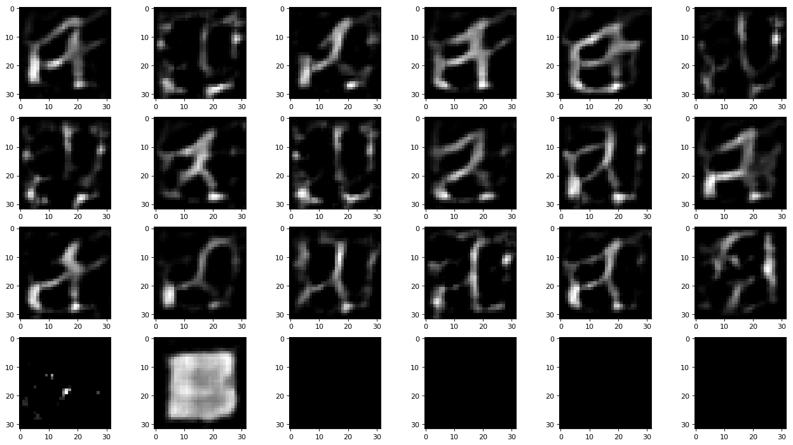

# MNIST encoder-decoder
A encoder-decoder system that encode mnist(28x28)image to 16-dimension vector and decode it.
## Result

### Original image

### Encode-decoded image
- Test image above was encoded to 16-dimension vector.
- Then it decoded to image.
- You can see that the outline of the number is very clear but some details are removed.

### Smooth change
- I picked two random image(4,9) from test dataset and encoded both of them.
- Then generated vectors between them with linear interpolation.
- Then decoded them.

### Random
- Decoded random vector
- They still look like some kind of number.

### One-Hot
- First 16 images are decoded one-hot vector from 0 to 16.
- 17,18 are decoded image of zero vector(0,0,...,0) and full-one vector(1,1,...,1).
- 19 is decoded image of an encoding vector of all black image.
- You can see that there are still some white dots.
- 20 is decoded image of an encoding vector of all white image.
- You can see that the border of image is black.
- 21~24 are just black image. nothing.

## Source code
See [MNIST-encoder.ipynb](./MNIST-encoder.ipynb) for more details.